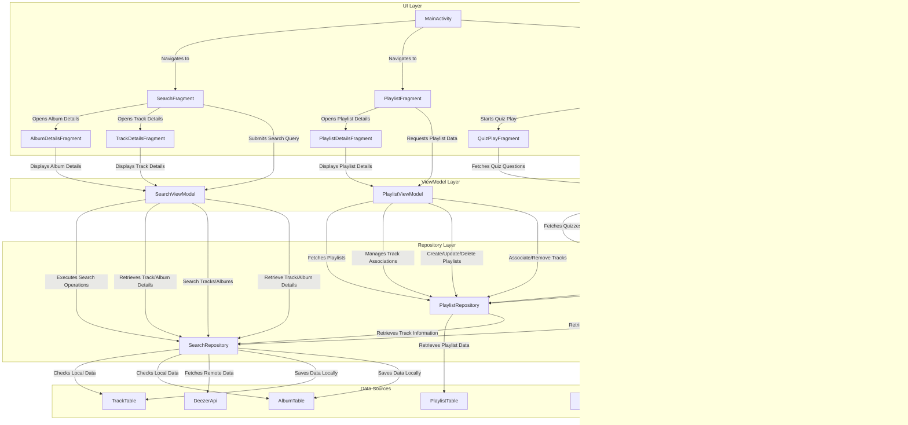

# **Music Search and Playlist Manager App**

## **Overview**

This application provides users with a seamless experience to search for music tracks and albums, view detailed information about them, and manage custom playlists. The app leverages the Deezer API for fetching music data and incorporates robust caching and persistence strategies to enhance user experience.

### **Key Features**

1. **Search Functionality:**
   - Search for tracks or albums using keywords.
   - View search results in a grid layout with album covers and track details.

2. **Detailed View:**
   - Get detailed information about tracks and albums, including contributors, release dates, genres, and more.
   - Play preview clips of tracks.

3. **Playlist Management:**
   - Create, view, and manage custom playlists.
   - Add tracks to playlists directly from the search results.

4. **Intuitive Navigation:**
   - Easily switch between Search and Playlist sections using a bottom navigation bar.

5. **Media Integration:**
   - Glide library for optimized image loading and caching.
   - MediaPlayer for audio playback of track previews.

### **Illustrative Screenshots**

*   **Search for Music:** Users can search for tracks and albums using the search screen.

    
    

*   **View Album and Track Details:** Detailed information about albums and tracks can be viewed on separate detail screens.

    
    

*   **Create and Manage Playlists:** Users can create custom playlists and add/remove tracks to/from them.

    
    
    

*   **Audio Preview:** You can play preview of the music track
   
*  **Remove Playlists**:  You can remove playlist from playlist screen

---

## **Technical Architecture**

### **Architecture Overview**

The app follows the **Model-View-ViewModel (MVVM)** architecture to ensure separation of concerns, improved testability, and maintainability.

### **Architecture Diagram**

### **Implementation Choices**

#### **MVVM Pattern**
- **View Layer:** Contains fragments for search, album details, and playlist management. Each fragment interacts with the ViewModel to display data and handle user interactions.
- **ViewModel Layer:** Acts as the logic holder for fetching and managing data. Uses `LiveData` to observe and propagate changes to the UI. Coroutine scopes are utilized for async operations.
- **Repository Layer:** Manages data sources. It checks for cached data in Room first and fetches from the Deezer API using Retrofit if needed.

#### **Caching Mechanism**
- Images are cached using the Glide library, optimizing performance and reducing network calls.
- Tracks, albums, and playlists are stored in a Room database to support offline access and persistent user data.

#### **Recent Searches**
- Recent searches are saved in Room with timestamps to allow users to revisit previous queries.

#### **Retrofit Integration**
- Retrofit and Gson are used for making and parsing network requests to the Deezer API. HTTP logging is added for easier debugging of API calls.

---

### **Unresolved Technical Challenges**

#### - Robust Error Handling: The app provides basic error handling, showing error messages with `Toast` messages. This is not user friendly and not informative of the underlying problems.

#### - Search Optimization: Add search suggestions and advanced filters like genre and release date

#### - Full Offline Mode Functionality: While the app has a basic setup for offline mode by storing playlist data and track ids, the app doesn't fully cache recent searches or playlists. The current implementation doesn't handle cases where the user has no internet.

#### - Audio player improvements: The current audio player is very basic and has not proper UI components to show the user its state.

#### - Dynamic UI Adaptability: The UI components, though functional, are not dynamically adaptable to different screen sizes and resolutions.

#### - Advanced Quiz Options: The app has only one game mode (multiple choices) implemented. Other game modes, such as "fill in the blanks" are not implemented yet.

---
### Contributors and Contributions

This project was developed collaboratively by:

- **Yusif Askari:**

    *   **Data Management and Persistence:** Primarily responsible for the development of the data layer, including:
        *   Designing and implementing the **local database schema** using Room to store playlists, tracks, albums and quizzes.
        *   Creating the **data access objects (DAOs)** and implementing all database interactions.
         * Managing the interaction with remote data source (Deezer API).
         *   Implementing the **Repository layer** for data retrieval and manipulation, providing a clean interface for ViewModels.
        *   Implementing caching strategy for API data and images with Glide, improving data consistency, and enabling the partial offline mode.
    *   Also contributed to the design and implementation of the **audio preview** functionality for playing preview of the tracks.

- **Ismayil Abdullazada:**

    *   **UI Development and State Management:** Primarily responsible for the UI implementation and state management, including:
        *   Developing the **ViewModel layer**, handling the data processing for all fragments, and providing LiveData to the UI.
         * Implemented navigation for the application based on bottom navigation and fragment transactions.
        * Creating the **Fragment-based UI layer**, designing and implementing all the fragments, including the search, playlist, and quiz features.
        *   Integrating **LiveData** and a ViewModel-based architecture, managing the state of the app, and handling UI updates.
    *  Also contributed to implementing the quiz functionality, and its different game modes.

Both collaborators shared responsibility for:

*   **Overall Architecture:** Discussed and selected the project architecture (MVVM).
*   **Debugging and Testing:** Collaborated on identifying and resolving bugs in different part of the code.
*  **Code Review:** Reviewing and merging each others code to ensure quality.

