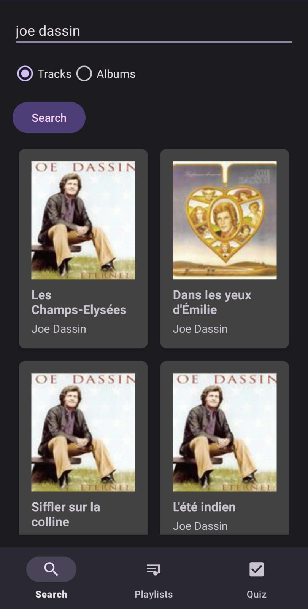
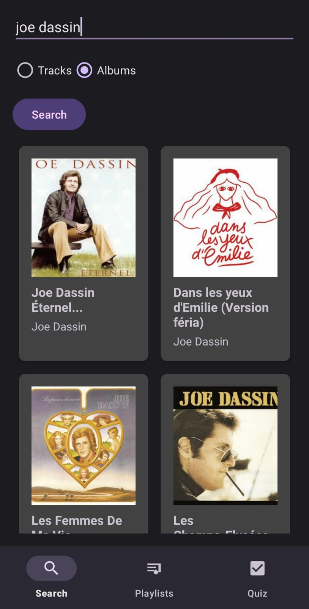
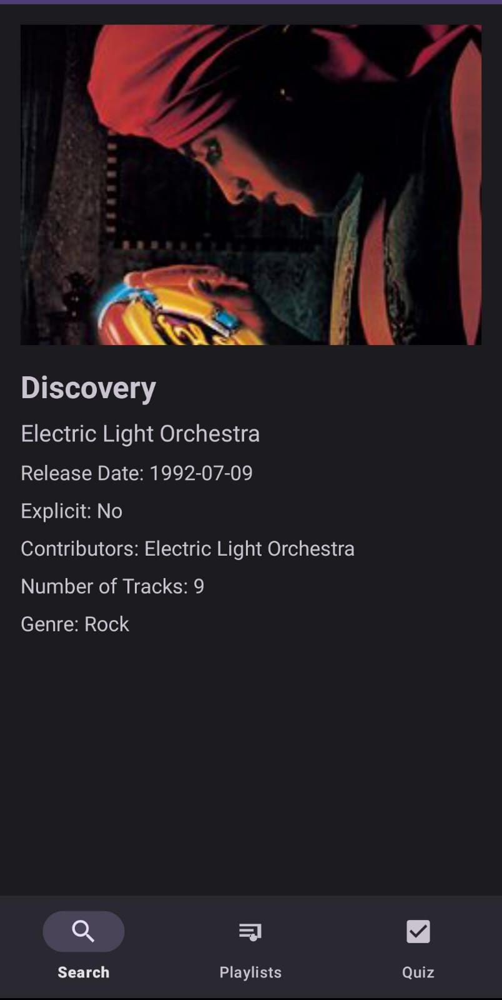
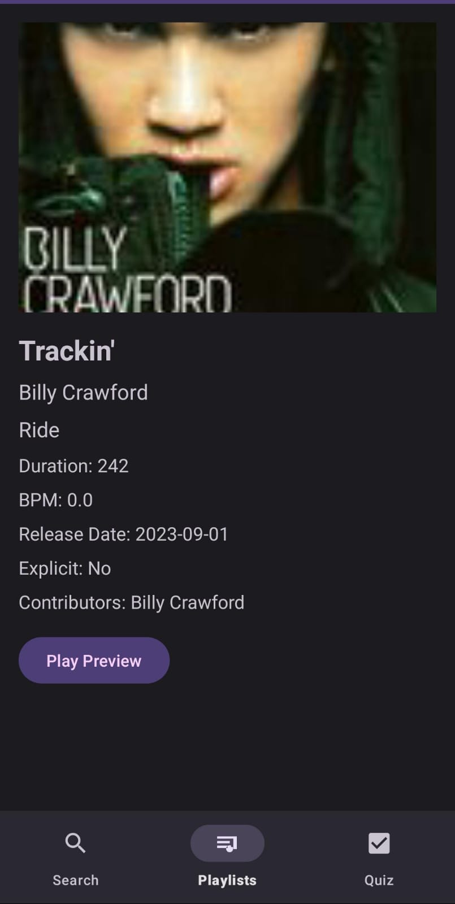
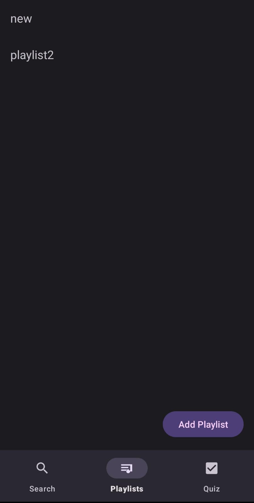
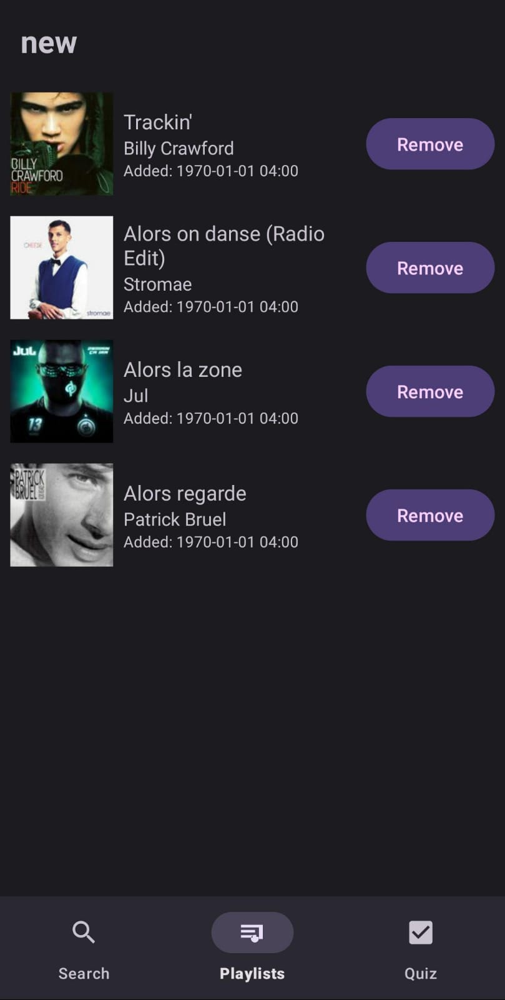
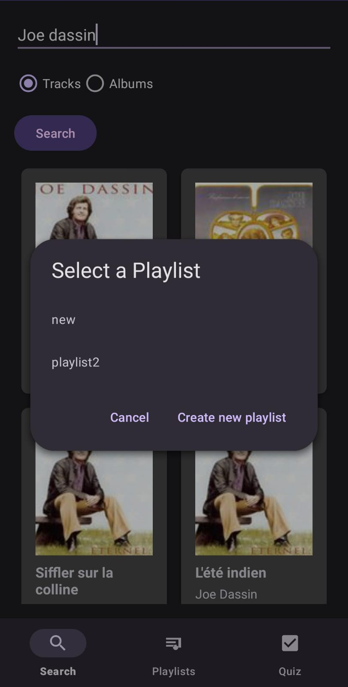
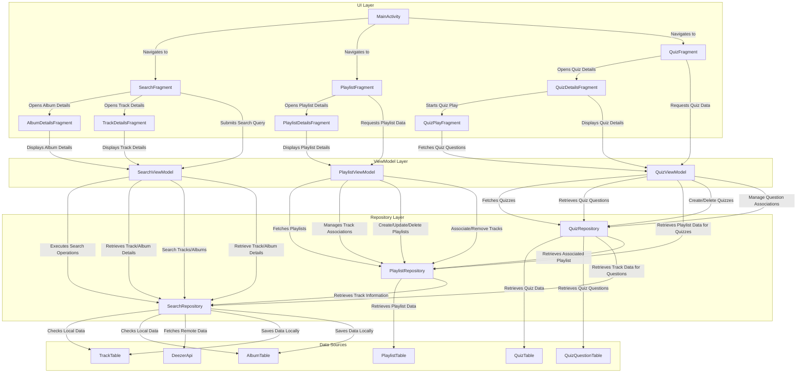

# **Music Search and Playlist Manager App**

## App Functionalities

This music app lets you explore music, create playlists, and test your music knowledge with fun quizzes. Here's a breakdown of the app's functionalities:

**I. Music Exploration:**

1.  **Search for Music:**
    *   Enter keywords to search for specific tracks or albums using the search bar.
    *   Choose between searching for tracks or albums using radio buttons.
    *   View search results with album art, track/album titles, and artist names in a scrollable grid.

2.  **View Detailed Information:**
    *   Tap on a search result to view a detailed screen.
        *   **For Tracks:** See the track title, artist, album, duration, bpm, release date, and listen to a short preview of the track.
        *   **For Albums:** See the album title, artist, release date, tracklist and other information.

**II. Playlist Management:**

1.  **Create Playlists:**
    *   Create custom playlists and name them.

2.  **View Playlists:**
    *   View all created playlists in a list with their names.

3.  **Add Tracks to Playlists:**
    *   Add tracks from search results to a playlist by long-pressing and selecting the playlist.

4.  **View Playlist Details:**
    *   View the playlist details and list of tracks.
    *   Remove tracks from the playlist.
5.  **Remove Playlists:**
    * Easily remove playlists from the playlist screen.

**III. Quiz Functionality:**

1.  **Create Quizzes:**
    *   Create a new quiz and name it.
    *   Select a playlist to use for the quiz.

2.  **List Quizzes:**
    *   View all created quizzes in a list with their names.

3.  **View Quiz Details:**
    *   See details for each quiz including quiz name and playlist used for the quiz.
    *   Start the quiz using a play button.

4.  **Play Quizzes:**
    *   Listen to a preview for each question.
    *   Answer questions in multiple-choice or open ended format.
    *  See the countdown timer for each question.
     *  See the results after quiz has been finished.

5.  **Remove Quizzes:**
    *  Easily remove quizzes from quiz screen.

**IV. Additional Features:**
1.  **Time Limits:**
    *   Answer questions within a configured time limit.

2.  **Audio Preview:**
    *   Preview music before adding to playlists or when playing quiz.

### **Illustrative Screenshots**

*   **Search for Music:** Users can search for tracks and albums using the search screen.

    
    

*   **View Album and Track Details:** Detailed information about albums and tracks can be viewed on separate detail screens.

    
    

*   **Create and Manage Playlists:** Users can create custom playlists and add/remove tracks to/from them.

    
    
    

*   **Audio Preview:** You can play preview of the music track
   
*  **Remove Playlists**:  You can remove playlist from playlist screen

---

## **Technical Architecture**

### **Architecture Overview**

The app follows the **Model-View-ViewModel (MVVM)** architecture to ensure separation of concerns, improved testability, and maintainability.

### **Architecture Diagram**

### **Implementation Choices**

1.  **MVVM Architecture:** We adopted the Model-View-ViewModel (MVVM) architectural pattern it provides a clean separation of concerns, making the code more maintainable, testable, and scalable. Fragments act as the View layer to manage the UI, ViewModels manage the UI-related data, and Repositories handle data access and logic.

2.  **Room Persistence Library:** We used Room as the local persistence library to manage the local database, such as to define database entities (playlists, tracks, quizzes, questions), data access objects (DAOs), and the database itself, making database operations smooth and structured.

4.  **Retrofit for API Communication:** We use Retrofit for making API calls to the Deezer service, converting JSON responses into our `Track` and `Album` data classes.

5.  **Glide for Image Loading:** We use Glide for image loading since it makes efficient image loading from network or local sources and provides image caching and optimizes loading for better performance.

6.  **Android Architecture Components:** We made extensive use of Android Architecture Components.
        *   **LiveData:** Used to manage data updates in the UI.
         * **ViewModel:** Used to handle the UI logic for all the fragments and providing data to the UI.
        *   **Navigation Component:** Used to manage fragment transactions and navigation between different fragments.

7.  **RecyclerView:** We used `RecyclerView` for displaying search results, playlists, quiz lists and quizzes.

8.  **Coroutines for Asynchronous Operations:** We used Kotlin Coroutines to perform operations like to handinge network operations, data fetching, and database operations asynchronously in our viewmodels.
---

### **Unresolved Technical Challenges**

#### - Robust Error Handling: The app provides basic error handling, showing error messages with `Toast` messages. This is not user friendly and not informative of the underlying problems.

#### - Search Optimization: Add search suggestions and advanced filters like genre and release date

#### - Full Offline Mode Functionality: While the app has a basic setup for offline mode by storing playlist data and track ids, the app doesn't fully cache recent searches or playlists. The current implementation doesn't handle cases where the user has no internet.

#### - Audio player improvements: The current audio player is very basic and has not proper UI components to show the user its state.

#### - Dynamic UI Adaptability: The UI components, though functional, are not dynamically adaptable to different screen sizes and resolutions.

#### - Advanced Quiz Options: The app has only one game mode (multiple choices) implemented. Other game modes, such as "fill in the blanks" are not implemented yet.

---
### Contributors and Contributions

This project was developed collaboratively by:

- **Yusif Askari:**

    *   **Data Management and Persistence:** Primarily responsible for the development of the data layer, including:
        *   Designing and implementing the **local database schema** using Room to store playlists, tracks, albums and quizzes.
        *   Creating the **data access objects (DAOs)** and implementing all database interactions.
         * Managing the interaction with remote data source (Deezer API).
         *   Implementing the **Repository layer** for data retrieval and manipulation, providing a clean interface for ViewModels.
        *   Implementing caching strategy for API data and images with Glide, improving data consistency, and enabling the partial offline mode.
    *   Also contributed to the design and implementation of the **audio preview** functionality for playing preview of the tracks.

- **Ismayil Abdullazada:**

    *   **UI Development and State Management:** Primarily responsible for the UI implementation and state management, including:
        *   Developing the **ViewModel layer**, handling the data processing for all fragments, and providing LiveData to the UI.
         * Implemented navigation for the application based on bottom navigation and fragment transactions.
        * Creating the **Fragment-based UI layer**, designing and implementing all the fragments, including the search, playlist, and quiz features.
        *   Integrating **LiveData** and a ViewModel-based architecture, managing the state of the app, and handling UI updates.
    *  Also contributed to implementing the quiz functionality, and its different game modes.

Both collaborators shared responsibility for:

*   **Overall Architecture:** Discussed and selected the project architecture (MVVM).
*   **Debugging and Testing:** Collaborated on identifying and resolving bugs in different part of the code.
*  **Code Review:** Reviewing and merging each others code to ensure quality.

